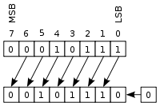

Operação de Bitwise Shift

Operação de Bitwise Shift
=========================

Os operadores de Bitwise Shift são utilizados para deslocar bits de um número inteiro para direita ou para a esquerda.

Left Shift
----------

Em um deslocamento aritmético à esquerda, os bits são deslocados para a esquerda e zeros são acrescentados à direita como demonstra a imagem: 


Sua sintaxe respectivamente o valor inteiro, o operador '<<' e o numero de bits a ser deslocado

O número de bits a ser deslocado equivale a quantidade de vezes que o valor será multiplicado por 2.

Right Shift
-----------

Em um deslocamento aritmético para a direita, o bit de sinal é deslocado da esquerda, preservando, assim, o sinal do operando como demonstra a imagem:


Sua sintaxe respectivamente o valor inteiro, o operador '>>' e o numero de bits a ser deslocado

O número de bits a ser deslocado equivale a quantidade de vezes que o valor será dividido por 2, sempre resultando em um valor inteiro.

Tabela de compatibilidade de tipos da operação de Bitwise SHIFT
---------------------------------------------------------------

| Operando Esquerdo | Operando Direito | Tipo Resultado | Exemplo | Resultado |
| --- | --- | --- | --- | --- |
| inteiro | inteiro | inteiro | 12 >> 2 | 3 |
| inteiro | inteiro | inteiro | 12 << 2 | 48 |

O exemplo a seguir ilustra em portugol os mesmos exemplos usados anteriormente.

```
programa
{
    funcao inicio()
    {	
		escreva (23 << 1, "\n", -105 >> 1)
    }
}

```

